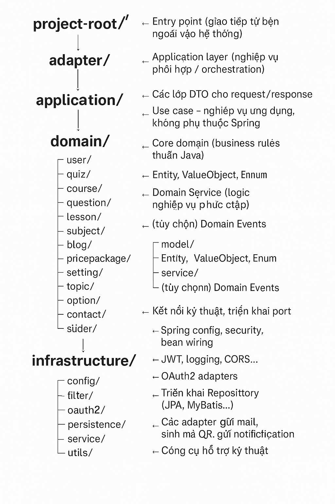
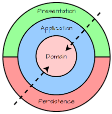

# 🏗 Quiz Practice System – Clean Architecture Overview

Dự án áp dụng **Clean Architecture** với định hướng **Modular Monolith**, được tổ chức thành các tầng độc lập rõ ràng nhằm đảm bảo:

- Tách biệt giữa nghiệp vụ và hạ tầng kỹ thuật
- Dễ dàng mở rộng, bảo trì và kiểm thử
- Có khả năng tách dần thành microservices nếu cần về sau

Dưới đây là sơ đồ tổng quan về cấu trúc dự án:
 

---

## Giải thích từng tầng

### 🔶 `adapter/` – Interface Adapter
- Là entrypoint chính của ứng dụng: nhận request từ client qua `REST` hoặc `WebSocket`.
- Chỉ có nhiệm vụ gọi đúng `UseCase`, không chứa logic nghiệp vụ.

### 🔶 `application/` – Application Layer
- Là nơi orchestration các hành vi nghiệp vụ.
- Các `UseCase` phối hợp domain.
- Không phụ thuộc Spring hay bất kỳ hạ tầng nào.

### 🔶 `domain/` – Domain Layer
- Là trung tâm của kiến trúc.
- Chia thành các package tương ứng với các nhóm đối tượng trong DB
- Chứa:
    - `model/`: Entity, Value Object, Enum
    - `service/`: Domain Service
    - `event/`: Các sự kiện nghiệp vụ (nếu có)
- **Không phụ thuộc bất kỳ tầng nào khác.**

### 🔶 `infrastructure/` – Infrastructure Layer
- Là nơi triển khai các hành vi kỹ thuật:
    - Kết nối CSDL
    - Gửi email, xử lý file Excel, sinh QR code
    - Xác thực JWT, OAuth2, cấu hình Spring Security
- Service ở đây khác với service của domain ở chỗ, nó là dịch vụ bên ngoài

---

## Ưu điểm của kiến trúc này

- **Tách biệt rõ ràng nghiệp vụ và hạ tầng**
- **Dễ test**, vì logic nghiệp vụ không phụ thuộc framework
- **Mở rộng dễ**: thêm API mới chỉ cần tạo controller → gọi lại UseCase
- **Khả năng scale tốt**: dễ trích xuất feature sang microservice khi cần

---

## Hướng mở rộng trong tương lai

- Tách rõ `port/in` và `port/out` trong `application`
- Dùng `Domain Event` mạnh mẽ hơn (ví dụ: khi submit quiz, phát sự kiện)
- Triển khai `Scheduler`, `Batch`, `EventListener` như các adapter

---

## Các Loại Commit Thường Dùng

Danh sách các loại commit thường dùng và ý nghĩa của chúng:

- feat: Một tính năng mới cho người dùng hoặc hệ thống.

  - Ví dụ: feat: cho phép người dùng tải ảnh đại diện lên

- fix: Một bản sửa lỗi giúp khắc phục sự cố trong code.

  - Ví dụ: fix: khắc phục lỗi căn lề trên nút đăng nhập

- refactor: Thay đổi mã mà không sửa lỗi hoặc thêm tính năng mới.

  - Ví dụ: refactor: đơn giản hóa logic của user service

- docs: Chỉ thay đổi liên quan đến tài liệu (ví dụ: cập nhật README, thêm tài liệu API).

  - Ví dụ: docs: cập nhật hướng dẫn cài đặt trong README.md

- chore: Các thay đổi nhỏ không ảnh hưởng đến mã sản phẩm (ví dụ: cập nhật script build, cấu hình package manager).

  - Ví dụ: chore: thêm file cấu hình prettier

- style: Các thay đổi không ảnh hưởng đến logic code (ví dụ: khoảng trắng, định dạng, thiếu dấu chấm phẩy, thay đổi CSS/giao diện).

  - Ví dụ: style: định dạng lại mã theo hướng dẫn của dự án

- perf: Thay đổi mã giúp cải thiện hiệu suất.

  - Ví dụ: perf: tối ưu truy vấn cơ sở dữ liệu cho dashboard người dùng

- vendor: Cập nhật các gói hoặc thư viện bên thứ ba.
  - Ví dụ: vendor: nâng cấp react lên phiên bản 18.3.0

---

## Ghi chú

- Mỗi `domain/*` là một **bounded context**, được tổ chức độc lập và có thể tái sử dụng.
- Mỗi tầng **chỉ phụ thuộc vào tầng trong**, không có phụ thuộc ngược.

---

> Kiến trúc này đang được áp dụng để triển khai toàn bộ các chức năng đã được liệt kê trong tài liệu `QuizPractice_Requirements.pdf`, bao gồm: quản lý quiz, users, blogs, slider, khóa học, đăng ký học, luyện tập, chấm điểm và phân quyền người dùng.
